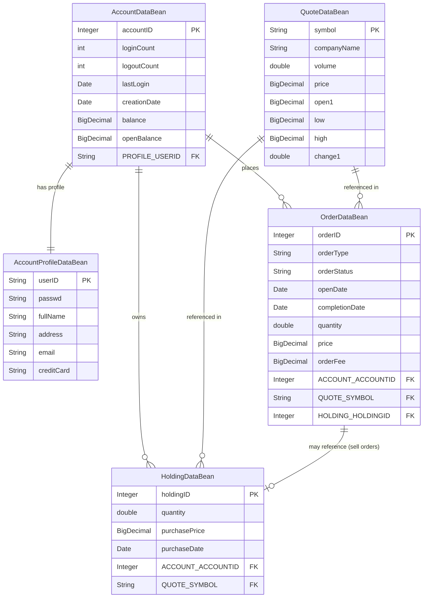

# DayTrader Documentation

This branch (gen-doc) demonstrates how to document the current codebase apprpriately

## Pre Reqs if you want to run yourself
* Delete existing CLAUDE.md file
* Delete everything out of the docs/diagrams and docs/ folders
* Run claude /init
* Set up MCPs - see below
* Review tasks in tasks.json and reset every status to `pending` if it's not already

## MCPs
* Copy the mcp.json.example file to the root directory and remove the `.example` suffix
* Add your API keys where appropriate

### Investigation
Used claude code with this prompt to generate the `document-gathering.md` file
```
I want to use claude code on the current directory to completely understand the codebase under the app directory. I want to write extremely comprehensive and accurate documentation in markdown and generate diagrams with in mermaid format. The ultimate goal is to rewrite the application in springboot and angular so I need to ensure I capture all business logics, flows, interactions etc. The docs will got in the docs directory and the diagrams in docs/diagrams. I was thinking of using claude task master to guide the exercise and maybe a database mcp to hold the information generated. Provide the best advice for achieving this and document it in a document-gathering.md file
```

## Running
You can either:

* Create tasks and kick of task master
OR
* Run the scripts to create the docs

### Using the scripts

  1. Initial Setup (Run Once)

  cd /Users/jp/work/ai-messin/daytrader

  # First, create the database initialization scripts
  ./scripts/create-db-scripts.sh

  # Then run the main setup
  ./scripts/setup-docs.sh

## Now you can start the MCP server

  # Load the environment variables
  source .env.documentation

  2. Documentation Phases (Run Sequentially)

  # Phase 1: Component Discovery (Days 1-2)
  ./scripts/run-phase1.sh

  # Phase 2: Business Logic Extraction (Days 3-5)
  ./scripts/run-phase2.sh

  # Phase 3: Diagram Generation (Days 6-7)
  ./scripts/run-phase3.sh

  3. Utility Scripts (Run As Needed)

  # Check documentation progress
  ./scripts/update-docs.sh status

  # Create Claude tasks for specific analysis
  ./scripts/claude-tasks.sh create "EJB Analysis" component-scan docs/ejb-analysis.md

  # Mark components as documented
  ./scripts/update-docs.sh mark-complete servlet TradeAppServlet

  # Search documentation
  ./scripts/update-docs.sh search "login flow"

  4. Final Report (Run After Phases Complete)

  # Generate comprehensive documentation report
  ./scripts/generate-report.sh

  Note: The phase scripts create task templates for Claude to execute. In practice, you would run Claude with these tasks between phases to actually
  generate the documentation content.

---

# DayTrader3 JPA Entity Relationship Documentation

## Overview

The DayTrader3 application uses JPA (Java Persistence API) 2.0 for object-relational mapping. The persistence unit is configured to use JTA transactions with the following data sources:
- JTA Data Source: `jdbc/TradeDataSource`
- Non-JTA Data Source: `jdbc/NoTxTradeDataSource`

## JPA Entities

### 1. AccountDataBean (lines 30-302)

**Entity Details:**
- **Entity Name:** `accountejb`
- **Table Name:** `accountejb`
- **Primary Key:** `accountID` (Integer)
  - Generation Strategy: TABLE (using `KEYGENEJB` table)
  - Generator: `accountIdGen` with allocation size 1000

**Column Mappings:**

| Field | Column Name | Type | Nullable | Notes |
|-------|-------------|------|----------|-------|
| accountID | ACCOUNTID | Integer | false | Primary key |
| loginCount | LOGINCOUNT | int | false | |
| logoutCount | LOGOUTCOUNT | int | false | |
| lastLogin | LASTLOGIN | Date | true | @Temporal(TIMESTAMP) |
| creationDate | CREATIONDATE | Date | true | @Temporal(TIMESTAMP) |
| balance | BALANCE | BigDecimal | true | |
| openBalance | OPENBALANCE | BigDecimal | true | |

**Relationships:**
- **OneToMany** with `OrderDataBean` (lines 80-81)
  - Mapped by: `account`
  - Fetch: LAZY
  - Bidirectional relationship
- **OneToMany** with `HoldingDataBean` (lines 83-84)
  - Mapped by: `account`
  - Fetch: LAZY
  - Bidirectional relationship
- **OneToOne** with `AccountProfileDataBean` (lines 86-88)
  - Join Column: `PROFILE_USERID`
  - Fetch: LAZY
  - Owning side of the relationship

**Transient Fields:**
- `profileID` (String) - line 95

**Named Queries:**
- `accountejb.findByCreationdate`
- `accountejb.findByOpenbalance`
- `accountejb.findByLogoutcount`
- `accountejb.findByBalance`
- `accountejb.findByAccountid`
- `accountejb.findByAccountid_eager` (includes profile fetch join)
- `accountejb.findByAccountid_eagerholdings` (includes holdings fetch join)
- `accountejb.findByLastlogin`
- `accountejb.findByLogincount`

### 2. AccountProfileDataBean (lines 23-189)

**Entity Details:**
- **Entity Name:** `accountprofileejb`
- **Table Name:** `accountprofileejb`
- **Primary Key:** `userID` (String) - Natural key, not generated

**Column Mappings:**

| Field | Column Name | Type | Nullable | Notes |
|-------|-------------|------|----------|-------|
| userID | USERID | String | false | Primary key |
| passwd | PASSWD | String | true | |
| fullName | FULLNAME | String | true | |
| address | ADDRESS | String | true | |
| email | EMAIL | String | true | |
| creditCard | CREDITCARD | String | true | |

**Relationships:**
- **OneToOne** with `AccountDataBean` (lines 58-59)
  - Mapped by: `profile`
  - Fetch: LAZY
  - Non-owning side (inverse relationship)

**Named Queries:**
- `accountprofileejb.findByAddress`
- `accountprofileejb.findByPasswd`
- `accountprofileejb.findByUserid`
- `accountprofileejb.findByEmail`
- `accountprofileejb.findByCreditcard`
- `accountprofileejb.findByFullname`

### 3. HoldingDataBean (lines 28-220)

**Entity Details:**
- **Entity Name:** `holdingejb`
- **Table Name:** `holdingejb`
- **Primary Key:** `holdingID` (Integer)
  - Generation Strategy: TABLE (using `KEYGENEJB` table)
  - Generator: `holdingIdGen` with allocation size 1000

**Column Mappings:**

| Field | Column Name | Type | Nullable | Notes |
|-------|-------------|------|----------|-------|
| holdingID | HOLDINGID | Integer | false | Primary key |
| quantity | QUANTITY | double | false | |
| purchasePrice | PURCHASEPRICE | BigDecimal | true | |
| purchaseDate | PURCHASEDATE | Date | true | @Temporal(TIMESTAMP) |

**Relationships:**
- **ManyToOne** with `AccountDataBean` (lines 68-70)
  - Join Column: `ACCOUNT_ACCOUNTID`
  - Fetch: LAZY
  - Owning side
- **ManyToOne** with `QuoteDataBean` (lines 72-74)
  - Join Column: `QUOTE_SYMBOL`
  - Fetch: EAGER
  - Owning side

**Transient Fields:**
- `quoteID` (String) - line 66

**Named Queries:**
- `holdingejb.findByPurchaseprice`
- `holdingejb.findByHoldingid`
- `holdingejb.findByQuantity`
- `holdingejb.findByPurchasedate`
- `holdingejb.holdingsByUserID` (joins through account to profile)

### 4. OrderDataBean (lines 29-363)

**Entity Details:**
- **Entity Name:** `orderejb`
- **Table Name:** `orderejb`
- **Primary Key:** `orderID` (Integer)
  - Generation Strategy: TABLE (using `KEYGENEJB` table)
  - Generator: `orderIdGen` with allocation size 1000

**Column Mappings:**

| Field | Column Name | Type | Nullable | Notes |
|-------|-------------|------|----------|-------|
| orderID | ORDERID | Integer | false | Primary key |
| orderType | ORDERTYPE | String | true | buy/sell |
| orderStatus | ORDERSTATUS | String | true | open/processing/completed/closed/cancelled |
| openDate | OPENDATE | Date | true | @Temporal(TIMESTAMP) |
| completionDate | COMPLETIONDATE | Date | true | @Temporal(TIMESTAMP) |
| quantity | QUANTITY | double | false | |
| price | PRICE | BigDecimal | true | |
| orderFee | ORDERFEE | BigDecimal | true | |

**Relationships:**
- **ManyToOne** with `AccountDataBean` (lines 86-88)
  - Join Column: `ACCOUNT_ACCOUNTID`
  - Fetch: LAZY
  - Owning side
- **ManyToOne** with `QuoteDataBean` (lines 90-92)
  - Join Column: `QUOTE_SYMBOL`
  - Fetch: EAGER
  - Owning side
- **OneToOne** with `HoldingDataBean` (lines 94-96)
  - Join Column: `HOLDING_HOLDINGID`
  - Fetch: LAZY
  - Owning side (for sell orders)

**Transient Fields:**
- `symbol` (String) - line 103

**Named Queries:**
- `orderejb.findByOrderfee`
- `orderejb.findByCompletiondate`
- `orderejb.findByOrdertype`
- `orderejb.findByOrderstatus`
- `orderejb.findByPrice`
- `orderejb.findByQuantity`
- `orderejb.findByOpendate`
- `orderejb.findByOrderid`
- `orderejb.findByAccountAccountid`
- `orderejb.findByQuoteSymbol`
- `orderejb.findByHoldingHoldingid`
- `orderejb.closedOrders` (finds closed orders by userID)
- `orderejb.completeClosedOrders` (updates closed orders to completed)

### 5. QuoteDataBean (lines 33-234)

**Entity Details:**
- **Entity Name:** `quoteejb`
- **Table Name:** `quoteejb`
- **Primary Key:** `symbol` (String) - Natural key, not generated

**Column Mappings:**

| Field | Column Name | Type | Nullable | Notes |
|-------|-------------|------|----------|-------|
| symbol | SYMBOL | String | false | Primary key |
| companyName | COMPANYNAME | String | true | |
| volume | VOLUME | double | false | |
| price | PRICE | BigDecimal | true | |
| open1 | OPEN1 | BigDecimal | true | Opening price |
| low | LOW | BigDecimal | true | |
| high | HIGH | BigDecimal | true | |
| change1 | CHANGE1 | double | false | Price change |

**Relationships:**
- No explicit relationships defined (referenced by other entities)
- Serves as a reference entity for Holdings and Orders

**Named Queries:**
- `quoteejb.allQuotes`
- `quoteejb.quotesByChange` (finds quotes starting with 's:1__' ordered by change)
- `quoteejb.findByLow`
- `quoteejb.findByOpen1`
- `quoteejb.findByVolume`
- `quoteejb.findByPrice`
- `quoteejb.findByHigh`
- `quoteejb.findByCompanyname`
- `quoteejb.findBySymbol`
- `quoteejb.findByChange1`

**Named Native Queries:**
- `quoteejb.quoteForUpdate` - Uses SELECT FOR UPDATE for pessimistic locking

## Entity Relationships Diagram



## Relationship Details

### Foreign Key Relationships

1. **Account ↔ Profile (One-to-One)**
   - Account owns the relationship via `PROFILE_USERID` foreign key
   - Bidirectional relationship
   - Both sides use LAZY fetch

2. **Account → Orders (One-to-Many)**
   - Order owns the relationship via `ACCOUNT_ACCOUNTID` foreign key
   - Bidirectional relationship
   - Account side uses LAZY fetch

3. **Account → Holdings (One-to-Many)**
   - Holding owns the relationship via `ACCOUNT_ACCOUNTID` foreign key
   - Bidirectional relationship
   - Account side uses LAZY fetch

4. **Quote → Orders (One-to-Many)**
   - Order owns the relationship via `QUOTE_SYMBOL` foreign key
   - Unidirectional from Order side
   - Order side uses EAGER fetch

5. **Quote → Holdings (One-to-Many)**
   - Holding owns the relationship via `QUOTE_SYMBOL` foreign key
   - Unidirectional from Holding side
   - Holding side uses EAGER fetch

6. **Order → Holding (One-to-One)**
   - Order owns the relationship via `HOLDING_HOLDINGID` foreign key
   - Used for sell orders to reference the holding being sold
   - Unidirectional from Order side
   - Order side uses LAZY fetch

### Cascade Rules
No explicit cascade rules are defined in the entities. All cascading would need to be handled programmatically.

### Fetch Strategies
- **LAZY**: Account-Profile, Account-Orders, Account-Holdings, Order-Account, Order-Holding, Holding-Account
- **EAGER**: Order-Quote, Holding-Quote

## Non-Entity Data Beans

The following classes are regular JavaBeans (not JPA entities):

1. **MarketSummaryDataBean** - Aggregates market data including top gainers/losers
2. **RunStatsDataBean** - Tracks runtime statistics for the application

## JPA Configuration Notes

From `persistence.xml`:
- Persistence unit name: `daytrader`
- Transaction type: JTA
- All entity classes are explicitly listed
- Unlisted classes are excluded (`<exclude-unlisted-classes>true</exclude-unlisted-classes>`)
- L2 caching is commented out but could be enabled with `<shared-cache-mode>ALL</shared-cache-mode>`

## Migration Considerations

1. **Primary Key Generation**: Uses table-based generation which may need adjustment for other databases
2. **Column Names**: All use uppercase convention
3. **No Version Fields**: Optimistic locking is commented out (see `@Version` comments)
4. **Native Query**: QuoteDataBean has a database-specific SELECT FOR UPDATE query
5. **Fetch Strategies**: Mixed EAGER/LAZY fetching may need optimization based on use cases
6. **No Cascade Operations**: All persistence operations must be explicitly managed
7. **Natural Keys**: AccountProfile uses userID and Quote uses symbol as natural primary keys