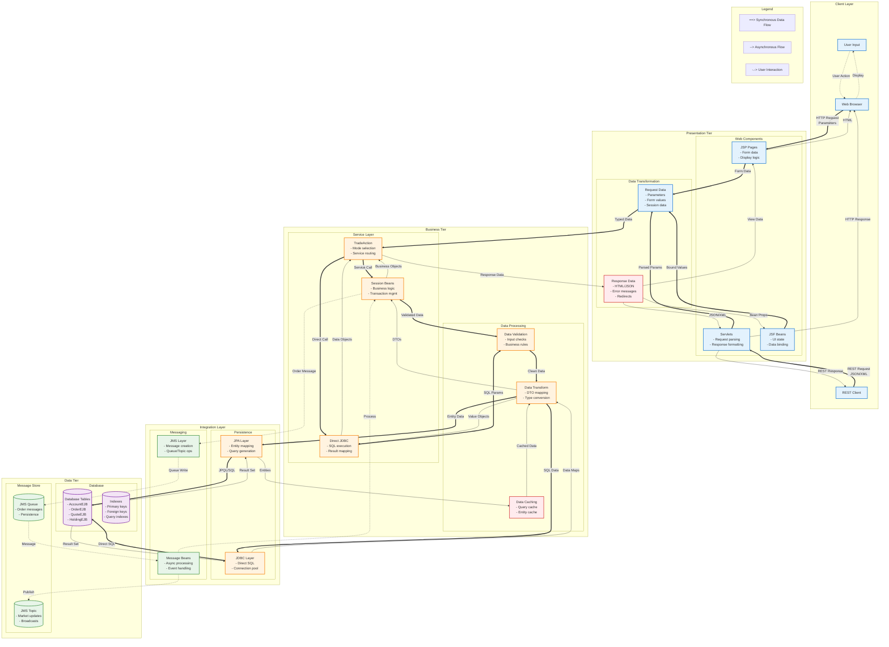

# DayTrader3 Architecture Documentation

**Last Updated**: 2025-07-22  
**Version**: 1.0.0  
**Status**: In Progress

## Table of Contents

1. [Executive Summary](#executive-summary)
2. [System Overview](#system-overview)
3. [Component Architecture](#component-architecture)
4. [Database Schema](#database-schema)
5. [Data Flow](#data-flow)
6. [Sequence Diagrams](#sequence-diagrams)
7. [Deployment Architecture](#deployment-architecture)
8. [Technology Stack](#technology-stack)
9. [Security Architecture](#security-architecture)
10. [Performance Considerations](#performance-considerations)
11. [References](#references)

## Executive Summary

DayTrader3 is a comprehensive Java EE6 benchmark application that simulates an online stock trading system. The application demonstrates enterprise-grade patterns including multi-tier architecture, distributed transactions, asynchronous messaging, and web services. It serves as both a performance benchmark and a reference implementation for Java EE best practices.

The architecture follows a classic three-tier model with clear separation between presentation, business logic, and data persistence layers. The system supports multiple runtime modes (EJB3, Direct JDBC, and Session) to facilitate performance comparisons and demonstrate different architectural approaches.

## System Overview

The DayTrader3 application implements a distributed, scalable architecture deployed on WebSphere Liberty Server. The system consists of multiple modules packaged as an Enterprise Archive (EAR) with distinct responsibilities:

- **Presentation Tier**: Web interface (JSP/JSF) and REST API endpoints
- **Business Tier**: EJB session beans, message-driven beans, and business services
- **Data Tier**: JPA entities with Derby database persistence
- **Infrastructure**: JMS messaging for asynchronous order processing

### System Architecture Diagram

```mermaid
graph TB
    %% Title and Description
    Title[DayTrader3 System Architecture Overview]
    
    %% External Clients
    subgraph "External Clients"
        Browser[Web Browser]
        Mobile[Mobile App]
        ExtSystem[External Trading Systems]
    end
    
    %% WebSphere Liberty Server Container
    subgraph "WebSphere Liberty Server"
        %% EAR Deployment
        subgraph "daytrader3-ee6.ear"
    
    %% Presentation Tier
    subgraph "Presentation Tier [daytrader3-ee6-web]"
        subgraph "Web Components"
            JSP[JSP Pages<br/>- tradehome.jsp<br/>- portfolio.jsp<br/>- account.jsp<br/>- quote.jsp<br/>- order.jsp<br/>- marketSummary.jsp]
            Servlets[Servlets<br/>- TradeAppServlet<br/>- TradeConfigServlet<br/>- TradeScenarioServlet<br/>- TradeBuildDB]
            JSF[JSF Beans<br/>- AccountBean<br/>- QuoteBean]
            Filters[Filters & Listeners<br/>- OrdersAlertFilter<br/>- TradeWebContextListener]
        end
        
        subgraph "Performance Testing"
            PerfServlets[Performance Servlets<br/>- PingServlet<br/>- PingServletEJB<br/>- PingServletJDBC<br/>- PingServletJMS]
        end
    end
    
    %% REST API Tier
    subgraph "REST API Tier [daytrader3-ee6-rest]"
        REST[REST Services<br/>- AddressBook API<br/>- /addresses/*]
    end
    
    %% Business Tier
    subgraph "Business Tier [daytrader3-ee6-ejb]"
        subgraph "Session Beans"
            SLSB[Stateless Session Beans<br/>- TradeSLSBBean<br/>- DirectSLSBBean]
            TradeAction[TradeAction<br/>Business Logic<br/>- EJB3 Mode<br/>- DIRECT Mode<br/>- SESSION3 Mode]
            TradeServices[TradeServices<br/>Interface]
        end
        
        subgraph "Message-Driven Beans"
            MDB[Message-Driven Beans<br/>- DTBroker3MDB<br/>- DTStreamer3MDB]
        end
        
        subgraph "Business Services"
            TradeDirect[TradeDirect<br/>Direct JDBC Access]
            TradeConfig[TradeConfig<br/>Runtime Configuration]
            Utils[Utilities<br/>- FinancialUtils<br/>- Log<br/>- MDBStats<br/>- KeyBlock]
        end
    end
    
    %% Data Tier
    subgraph "Data Tier"
        subgraph "JPA Entities"
            Entities[JPA Entity Beans<br/>- AccountDataBean<br/>- AccountProfileDataBean<br/>- HoldingDataBean<br/>- OrderDataBean<br/>- QuoteDataBean<br/>- MarketSummaryDataBean<br/>- RunStatsDataBean]
        end
        
        subgraph "Database"
            DB[(Derby Database<br/>Tables:<br/>- ACCOUNTEJB<br/>- ACCOUNTPROFILEEJB<br/>- HOLDINGEJB<br/>- ORDEREJB<br/>- QUOTEEJB<br/>- KEYGENEJB)]
        end
    end
    
    %% JMS Infrastructure
    subgraph "JMS Infrastructure"
        Queue[JMS Queue<br/>TradeBrokerQueue]
        Topic[JMS Topic<br/>TradeStreamerTopic]
    end
    
    %% Configuration
    subgraph "Configuration"
        Config[Configuration Files<br/>- server.xml<br/>- persistence.xml<br/>- web.xml<br/>- ejb-jar.xml<br/>- application.xml]
    end
    
        end %% End EAR
    end %% End Liberty Server
    
    %% Client connections
    Browser -->|HTTP/HTTPS| JSP
    Browser -->|HTTP/HTTPS| Servlets
    Mobile -->|REST/JSON| REST
    ExtSystem -->|REST/JSON| REST
    
    %% Presentation to Business tier
    JSP -->|Request| JSF
    JSF -->|EJB Local| TradeAction
    Servlets -->|EJB Local| TradeAction
    REST -->|EJB Local| TradeAction
    PerfServlets -->|Direct Call| SLSB
    PerfServlets -->|JDBC| DB
    
    %% Business tier internal flows
    TradeAction -->|"Runtime Mode:<br/>EJB3"| SLSB
    TradeAction -->|"Runtime Mode:<br/>DIRECT"| TradeDirect
    TradeAction <-.->|implements| TradeServices
    
    %% Session Bean interactions
    SLSB -->|JPA persist()| Entities
    SLSB -->|JPA query()| Entities
    
    %% Direct JDBC access
    TradeDirect -->|JDBC| DB
    
    %% JPA to Database
    Entities -->|JPA/Hibernate| DB
    
    %% Async messaging flows
    TradeAction -->|"Async Order<br/>Processing"| Queue
    Queue -->|JMS Message| MDB
    MDB -->|"Market Data<br/>Streaming"| Topic
    MDB -->|Update Orders| SLSB
    
    %% Configuration flows
    Config -.->|loads| TradeConfig
    TradeConfig -.->|configures| TradeAction
    Config -.->|DataSource| DB
    Config -.->|JMS Config| Queue
    Config -.->|JMS Config| Topic
    
    %% Styling
    classDef external fill:#e1f5fe,stroke:#01579b,stroke-width:2px
    classDef presentation fill:#fff3e0,stroke:#e65100,stroke-width:2px
    classDef business fill:#f3e5f5,stroke:#4a148c,stroke-width:2px
    classDef data fill:#e8f5e9,stroke:#1b5e20,stroke-width:2px
    classDef infra fill:#fce4ec,stroke:#880e4f,stroke-width:2px
    classDef config fill:#f5f5f5,stroke:#424242,stroke-width:2px
    
    class Browser,Mobile,ExtSystem external
    class JSP,Servlets,JSF,Filters,PerfServlets,REST presentation
    class SLSB,TradeAction,TradeServices,MDB,TradeDirect,TradeConfig,Utils business
    class Entities,DB data
    class Queue,Topic infra
    class Config config
    class Title title
    
    %% Legend
    subgraph "Legend"
        L1[→ Synchronous Call]
        L2[--> Asynchronous Message]  
        L3[-.-> Configuration/Dependency]
        L4[External System]:::external
        L5[Presentation Component]:::presentation
        L6[Business Component]:::business
        L7[Data Component]:::data
        L8[Infrastructure]:::infra
    end
    
    %% Hide title node connections
    Title -.-> Title
    
    classDef title fill:#fff,stroke:#fff,color:#000,font-weight:bold,font-size:16px
```

### Key Architectural Characteristics

1. **Multi-tier Architecture**: Clear separation between presentation, business, and data layers
2. **Modular Design**: Distinct modules for web, EJB, REST, and configuration
3. **Flexible Runtime Modes**: Support for EJB3, Direct JDBC, and hybrid approaches
4. **Asynchronous Processing**: JMS-based order processing for scalability
5. **Standards-Based**: Full Java EE6 compliance with standard APIs

## Component Architecture

*[To be completed - Detailed component structure and relationships]*

## Database Schema

The DayTrader3 database schema implements a normalized relational model for the trading application. For complete details including entity relationship diagrams and table specifications, see the [Database Schema Documentation](./database-schema.md).

### Schema Overview

The database consists of 7 primary tables:
- **ACCOUNTEJB**: Trading accounts with balances and statistics
- **ACCOUNTPROFILEEJB**: User profiles and authentication
- **HOLDINGEJB**: Stock positions in portfolios
- **ORDEREJB**: Buy/sell order transactions
- **QUOTEEJB**: Stock quotes and market data
- **KEYGENEJB**: ID generation sequences
- **OPENJPASEQ**: OpenJPA sequence support

Key relationships include:
- One-to-one between user profiles and accounts
- One-to-many from accounts to holdings and orders
- Many-to-one from orders/holdings to stock quotes

See the full [database schema documentation](./database-schema.md) for detailed specifications.

## Data Flow

The DayTrader3 application implements a multi-tier data flow architecture with clear separation between presentation, business logic, and persistence layers. Data transformation occurs at each tier boundary with validation, type conversion, and format adaptation.

### Multi-Tier Data Flow Architecture



### Key Data Flow Patterns

1. **Request Processing**: HTTP parameters are parsed, validated, and transformed into business objects
2. **Business Logic**: TradeAction routes to appropriate implementation based on runtime mode
3. **Persistence**: JPA entities or direct JDBC handle database operations
4. **Asynchronous Processing**: JMS messages enable decoupled order processing
5. **Response Generation**: Business objects are transformed into view models for presentation

## Sequence Diagrams

The following sequence diagrams illustrate critical user journeys and system interactions within DayTrader3:

### User Authentication Flow

[View full authentication sequence diagram](./diagrams/sequence-auth.mmd)

The authentication flow demonstrates:
- Login form submission and credential validation
- Session creation and management
- Error handling for invalid credentials
- Logout process and session invalidation

### Stock Trading Transactions

[View full trading sequence diagram](./diagrams/sequence-trading.mmd)

Trading operations include:
- Buy order placement with synchronous and asynchronous processing
- Sell order execution with holding validation
- Order status tracking and updates
- Integration with message-driven beans for async processing

### Portfolio and Account Management

[View full portfolio sequence diagram](./diagrams/sequence-portfolio.mmd)

Account management features:
- Portfolio viewing with real-time valuations
- Account profile updates
- Order history retrieval
- Market summary generation

### Asynchronous Message Processing

[View full async message flow diagram](./diagrams/async-message-flow.mmd)

Asynchronous patterns include:
- JMS queue-based order processing
- Message-driven bean transaction handling
- Market data streaming via topics
- Error handling and message redelivery

## Deployment Architecture

*[To be completed - Infrastructure and deployment topology]*

## Technology Stack

*[To be completed - Complete technology inventory]*

## Security Architecture

*[To be completed - Security layers and mechanisms]*

## Performance Considerations

*[To be completed - Performance design patterns and optimizations]*

## References

*[To be completed - Links to related documentation and resources]*