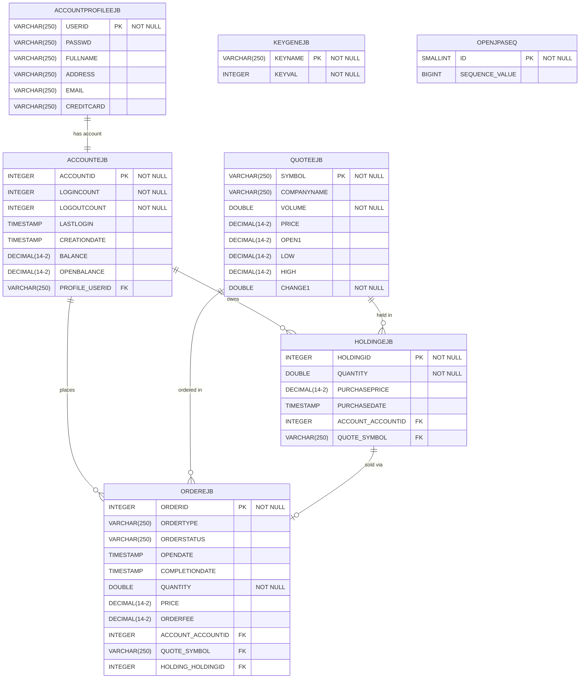

# DayTrader3 Database Schema Documentation

**Last Updated**: 2025-07-22  
**Version**: 1.0.0  
**Status**: Complete

## Table of Contents

1. [Overview](#overview)
2. [Entity Relationship Diagram](#entity-relationship-diagram)
3. [Table Specifications](#table-specifications)
   - [ACCOUNTEJB](#accountejb)
   - [ACCOUNTPROFILEEJB](#accountprofileejb)
   - [HOLDINGEJB](#holdingejb)
   - [ORDEREJB](#orderejb)
   - [QUOTEEJB](#quoteejb)
   - [KEYGENEJB](#keygenejb)
   - [OPENJPASEQ](#openjpaseq)
4. [Relationships](#relationships)
5. [Indexes](#indexes)
6. [Database Configuration](#database-configuration)

## Overview

The DayTrader3 database schema is designed to support a stock trading application with user accounts, portfolios, orders, and market quotes. The schema uses Apache Derby as the default database but is compatible with other JDBC-compliant databases.

### Key Characteristics

- **Database Type**: Apache Derby (embedded)
- **JPA Provider**: OpenJPA/EclipseLink
- **ID Generation**: Table-based sequence generation using KEYGENEJB
- **Transaction Management**: JTA with XA datasources
- **Connection Pools**: Configured in WebSphere Liberty

## Entity Relationship Diagram

## Table Specifications

### ACCOUNTEJB

**Purpose**: Stores trading account information including balances and login statistics.

| Column | Data Type | Constraints | Description |
|--------|-----------|-------------|-------------|
| ACCOUNTID | INTEGER | PRIMARY KEY, NOT NULL | Unique account identifier, auto-generated |
| LOGINCOUNT | INTEGER | NOT NULL | Number of times user has logged in |
| LOGOUTCOUNT | INTEGER | NOT NULL | Number of times user has logged out |
| LASTLOGIN | TIMESTAMP | NULL | Timestamp of last successful login |
| CREATIONDATE | TIMESTAMP | NULL | Account creation timestamp |
| BALANCE | DECIMAL(14,2) | NULL | Current account balance |
| OPENBALANCE | DECIMAL(14,2) | NULL | Initial account balance at creation |
| PROFILE_USERID | VARCHAR(250) | FOREIGN KEY | Links to user profile (ACCOUNTPROFILEEJB.USERID) |

**Business Logic**: 
- Balance is updated with each buy/sell transaction
- Login/logout counts track user activity
- Links to user profile for authentication

### ACCOUNTPROFILEEJB

**Purpose**: Stores user profile information and authentication credentials.

| Column | Data Type | Constraints | Description |
|--------|-----------|-------------|-------------|
| USERID | VARCHAR(250) | PRIMARY KEY, NOT NULL | Unique username for login |
| PASSWD | VARCHAR(250) | NULL | Encrypted password |
| FULLNAME | VARCHAR(250) | NULL | User's full name |
| ADDRESS | VARCHAR(250) | NULL | Mailing address |
| EMAIL | VARCHAR(250) | NULL | Email address |
| CREDITCARD | VARCHAR(250) | NULL | Credit card information (encrypted) |

**Business Logic**:
- Natural key using USERID (username)
- One-to-one relationship with ACCOUNTEJB
- Contains PII that should be encrypted

### HOLDINGEJB

**Purpose**: Represents stock holdings (positions) in user portfolios.

| Column | Data Type | Constraints | Description |
|--------|-----------|-------------|-------------|
| HOLDINGID | INTEGER | PRIMARY KEY, NOT NULL | Unique holding identifier, auto-generated |
| QUANTITY | DOUBLE | NOT NULL | Number of shares held |
| PURCHASEPRICE | DECIMAL(14,2) | NULL | Price per share at purchase |
| PURCHASEDATE | TIMESTAMP | NULL | Date/time of purchase |
| ACCOUNT_ACCOUNTID | INTEGER | FOREIGN KEY | Account that owns this holding |
| QUOTE_SYMBOL | VARCHAR(250) | FOREIGN KEY | Stock symbol for this holding |

**Business Logic**:
- Created when buy orders complete
- Deleted when sell orders complete
- Current value = QUANTITY * current QUOTE price

### ORDEREJB

**Purpose**: Records all buy and sell orders with their execution status.

| Column | Data Type | Constraints | Description |
|--------|-----------|-------------|-------------|
| ORDERID | INTEGER | PRIMARY KEY, NOT NULL | Unique order identifier, auto-generated |
| ORDERTYPE | VARCHAR(250) | NULL | 'buy' or 'sell' |
| ORDERSTATUS | VARCHAR(250) | NULL | 'open', 'completed', 'cancelled' |
| OPENDATE | TIMESTAMP | NULL | Order creation timestamp |
| COMPLETIONDATE | TIMESTAMP | NULL | Order completion timestamp |
| QUANTITY | DOUBLE | NOT NULL | Number of shares |
| PRICE | DECIMAL(14,2) | NULL | Price per share |
| ORDERFEE | DECIMAL(14,2) | NULL | Transaction fee |
| ACCOUNT_ACCOUNTID | INTEGER | FOREIGN KEY | Account placing the order |
| QUOTE_SYMBOL | VARCHAR(250) | FOREIGN KEY | Stock symbol |
| HOLDING_HOLDINGID | INTEGER | FOREIGN KEY | Holding being sold (sell orders only) |

**Business Logic**:
- Buy orders create new holdings when completed
- Sell orders reference existing holdings
- Status transitions: open → completed/cancelled
- Asynchronous processing via JMS

### QUOTEEJB

**Purpose**: Stores stock quote information and market data.

| Column | Data Type | Constraints | Description |
|--------|-----------|-------------|-------------|
| SYMBOL | VARCHAR(250) | PRIMARY KEY, NOT NULL | Stock ticker symbol |
| COMPANYNAME | VARCHAR(250) | NULL | Company name |
| VOLUME | DOUBLE | NOT NULL | Trading volume |
| PRICE | DECIMAL(14,2) | NULL | Current price |
| OPEN1 | DECIMAL(14,2) | NULL | Opening price (OPEN is reserved word) |
| LOW | DECIMAL(14,2) | NULL | Daily low price |
| HIGH | DECIMAL(14,2) | NULL | Daily high price |
| CHANGE1 | DOUBLE | NOT NULL | Price change amount |

**Business Logic**:
- Natural key using stock SYMBOL
- Updated by market data feeds
- Referenced by holdings and orders

### KEYGENEJB

**Purpose**: Table-based ID generation for JPA entities.

| Column | Data Type | Constraints | Description |
|--------|-----------|-------------|-------------|
| KEYNAME | VARCHAR(250) | PRIMARY KEY, NOT NULL | Generator name |
| KEYVAL | INTEGER | NOT NULL | Next available ID value |

**Key Names**:
- `account` - For ACCOUNTEJB.ACCOUNTID
- `holding` - For HOLDINGEJB.HOLDINGID
- `order` - For ORDEREJB.ORDERID

### OPENJPASEQ

**Purpose**: OpenJPA sequence table for additional ID generation support.

| Column | Data Type | Constraints | Description |
|--------|-----------|-------------|-------------|
| ID | SMALLINT | PRIMARY KEY, NOT NULL | Sequence identifier |
| SEQUENCE_VALUE | BIGINT | NULL | Current sequence value |

## Relationships

### One-to-One
- **ACCOUNTPROFILEEJB ↔ ACCOUNTEJB**: Each user profile has exactly one trading account

### One-to-Many
- **ACCOUNTEJB → HOLDINGEJB**: An account can own multiple stock holdings
- **ACCOUNTEJB → ORDEREJB**: An account can place multiple orders
- **QUOTEEJB → HOLDINGEJB**: A stock quote can be referenced by multiple holdings
- **QUOTEEJB → ORDEREJB**: A stock quote can be referenced by multiple orders

### Many-to-One
- **HOLDINGEJB → ACCOUNTEJB**: Each holding belongs to one account
- **HOLDINGEJB → QUOTEEJB**: Each holding references one stock quote
- **ORDEREJB → ACCOUNTEJB**: Each order belongs to one account
- **ORDEREJB → QUOTEEJB**: Each order references one stock quote
- **ORDEREJB → HOLDINGEJB**: Sell orders reference one holding (optional)

## Indexes

The following indexes optimize query performance:

| Index Name | Table | Columns | Purpose |
|------------|-------|---------|---------|
| ACCOUNT_USERID | ACCOUNTEJB | PROFILE_USERID | Fast lookup by user ID |
| HOLDING_ACCOUNTID | HOLDINGEJB | ACCOUNT_ACCOUNTID | Portfolio queries by account |
| ORDER_ACCOUNTID | ORDEREJB | ACCOUNT_ACCOUNTID | Order history by account |
| ORDER_HOLDINGID | ORDEREJB | HOLDING_HOLDINGID | Sell order lookups |
| CLOSED_ORDERS | ORDEREJB | ACCOUNT_ACCOUNTID, ORDERSTATUS | Completed order queries |

## Database Configuration

### Persistence Unit
- **Name**: daytrader
- **Transaction Type**: JTA
- **JTA Data Source**: jdbc/TradeDataSource
- **Non-JTA Data Source**: jdbc/NoTxTradeDataSource

### Connection Pools
Configured in `server.xml`:
- **TradeDataSource**: XA-capable for transactions
- **NoTxTradeDataSource**: Non-transactional for reads

### Database Properties
- **Derby Embedded**: Default configuration
- **Create**: true (auto-create schema)
- **User**: tradeuser
- **Password**: Configured in server.xml

### Performance Considerations
- Table-based ID generation for database portability
- Lazy loading for collections to minimize memory usage
- Indexes on foreign keys for join performance
- Optional L2 cache support (disabled by default)