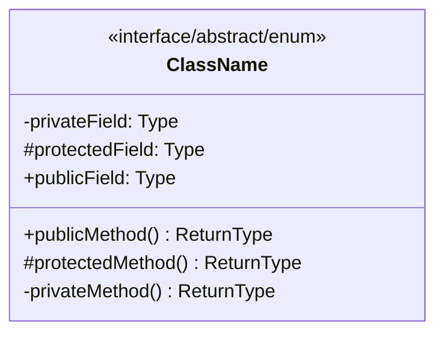

# Class: [ClassName]

**Package**: `[com.example.package]`  
**File**: `[path/to/file.java]`  
**Type**: `[Interface/Class/Abstract Class/Enum]`  
**Extends**: `[ParentClass]` *(if applicable)*  
**Implements**: `[Interface1, Interface2]` *(if applicable)*  

## Overview

*[Brief description of the class purpose and responsibility in 2-3 sentences]*

## Class Diagram



## Dependencies

- **Uses**: `[List of classes this class depends on]`
- **Used By**: `[List of classes that depend on this class]`

## Fields

### Private Fields

| Field | Type | Description |
|-------|------|-------------|
| `fieldName` | `Type` | Description of the field |

### Protected Fields

| Field | Type | Description |
|-------|------|-------------|
| `fieldName` | `Type` | Description of the field |

### Public Fields

| Field | Type | Description |
|-------|------|-------------|
| `fieldName` | `Type` | Description of the field |

## Constructors

### `ClassName()`
*[Description of default constructor]*

**Example**:
```java
ClassName instance = new ClassName();
```

### `ClassName(Type param1, Type param2)`
*[Description of parameterized constructor]*

**Parameters**:
- `param1` - Description of parameter 1
- `param2` - Description of parameter 2

**Example**:
```java
ClassName instance = new ClassName(value1, value2);
```

## Methods

### Public Methods

#### `methodName(Type param): ReturnType`
*[Description of what the method does]*

**Parameters**:
- `param` - Description of the parameter

**Returns**: Description of return value

**Throws**:
- `ExceptionType` - When this exception is thrown

**Example**:
```java
ReturnType result = instance.methodName(parameter);
```

### Protected Methods

*[Document protected methods similarly]*

### Private Methods

*[Document private methods similarly]*

## Business Logic

*[Detailed explanation of the core business logic implemented by this class]*

### Key Algorithms

*[Description of any important algorithms or complex logic]*

### State Management

*[How the class manages its internal state]*

### Transaction Handling

*[If applicable, how the class handles transactions]*

## Usage Examples

### Basic Usage
```java
// Example of typical usage
ClassName instance = new ClassName();
instance.doSomething();
```

### Advanced Usage
```java
// Example of more complex usage scenarios
```

## Configuration

*[Any configuration requirements or options]*

## Performance Considerations

*[Any performance implications or optimizations]*

## Security Considerations

*[Any security aspects to be aware of]*

## Known Issues

*[Any known limitations or issues]*

## See Also

- [[Related Class 1]](../path/to/doc.md)
- [[Related Class 2]](../path/to/doc.md)
- [[Interface Documentation]](../path/to/doc.md)