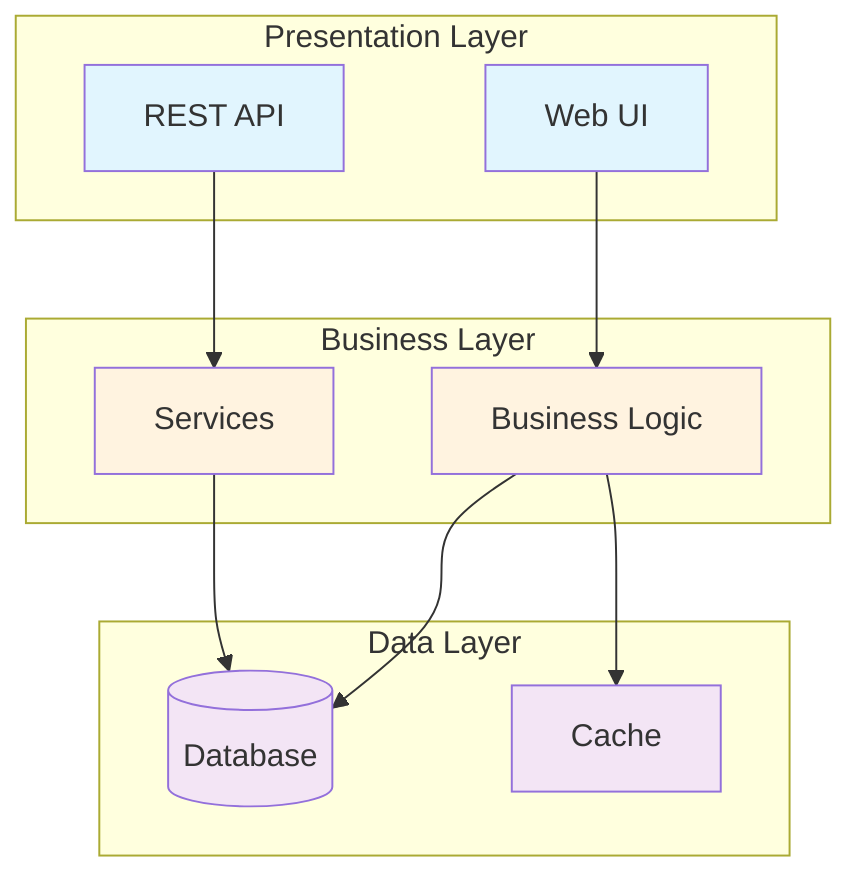
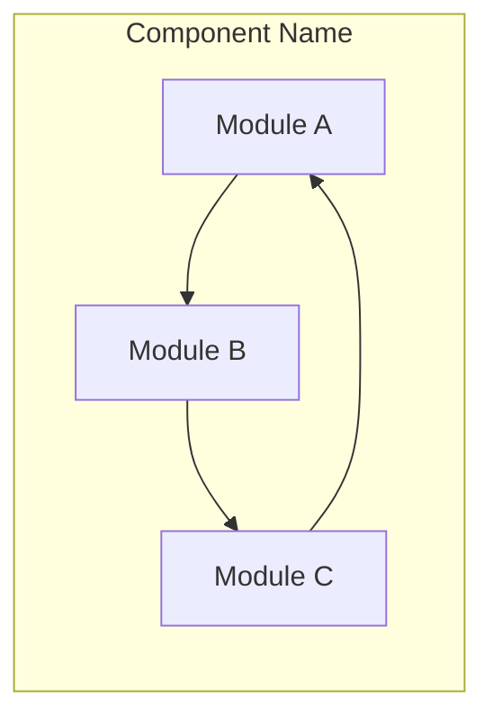
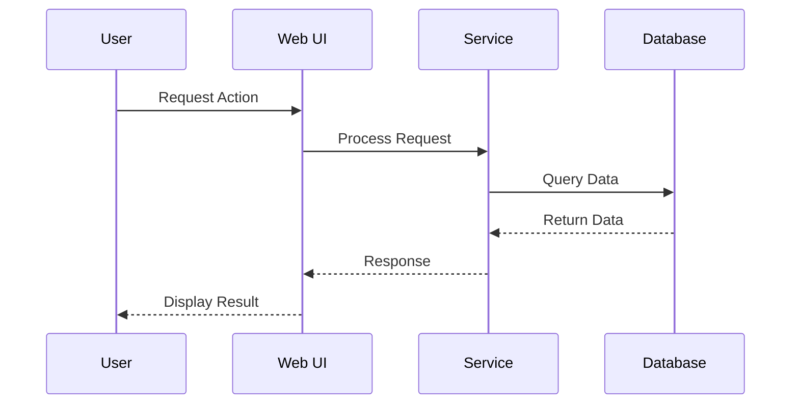
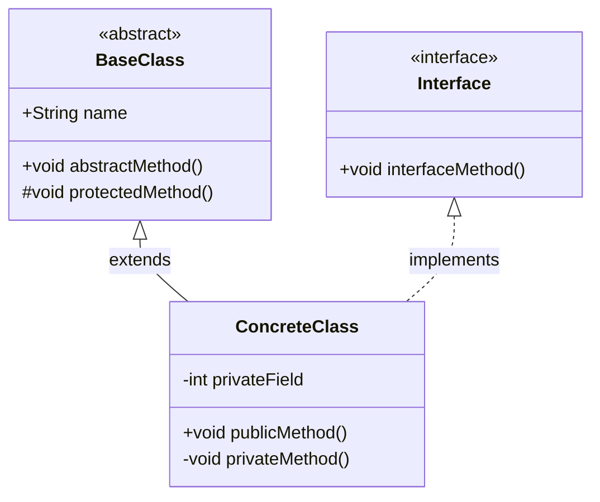
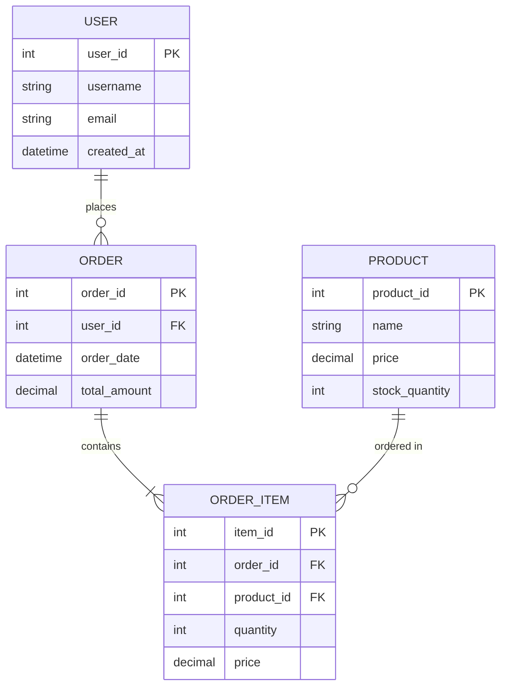
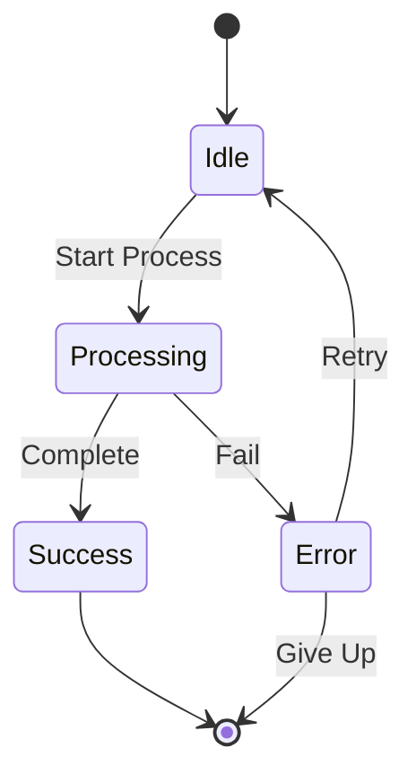
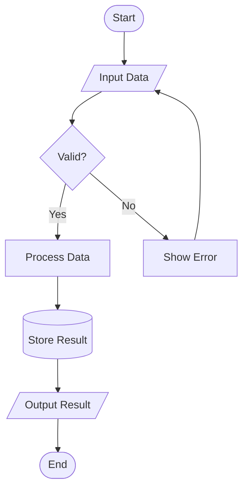

# Mermaid.js Diagram Template

## Diagram Types and Examples

### 1. System Architecture Diagram



### 2. Component Diagram



### 3. Sequence Diagram



### 4. Class Diagram



### 5. Entity Relationship Diagram



### 6. State Diagram



### 7. Flowchart



## Diagram Standards

### Color Scheme
- **Presentation Layer**: Light Blue (#e1f5fe)
- **Business Layer**: Light Orange (#fff3e0)
- **Data Layer**: Light Purple (#f3e5f5)
- **External Systems**: Light Green (#e8f5e9)
- **Error/Warning**: Light Red (#ffebee)

### Naming Conventions
- Use PascalCase for classes and components
- Use camelCase for methods and variables
- Use UPPERCASE for constants and enums
- Use lowercase_with_underscores for database entities

### Best Practices
1. Keep diagrams simple and focused on one aspect
2. Use consistent shapes and colors
3. Add clear labels and descriptions
4. Avoid overcrowding - split complex diagrams
5. Include a legend if using special symbols
6. Use subgraphs to group related components

### Mermaid Configuration
```mermaid
%%{init: {
  'theme': 'default',
  'themeVariables': {
    'primaryColor': '#fff',
    'primaryTextColor': '#000',
    'primaryBorderColor': '#7C4DFF',
    'lineColor': '#F44336',
    'background': '#fff',
    'mainBkg': '#e1f5fe',
    'secondBkg': '#fff3e0',
    'tertiaryColor': '#f3e5f5'
  }
}}%%
```